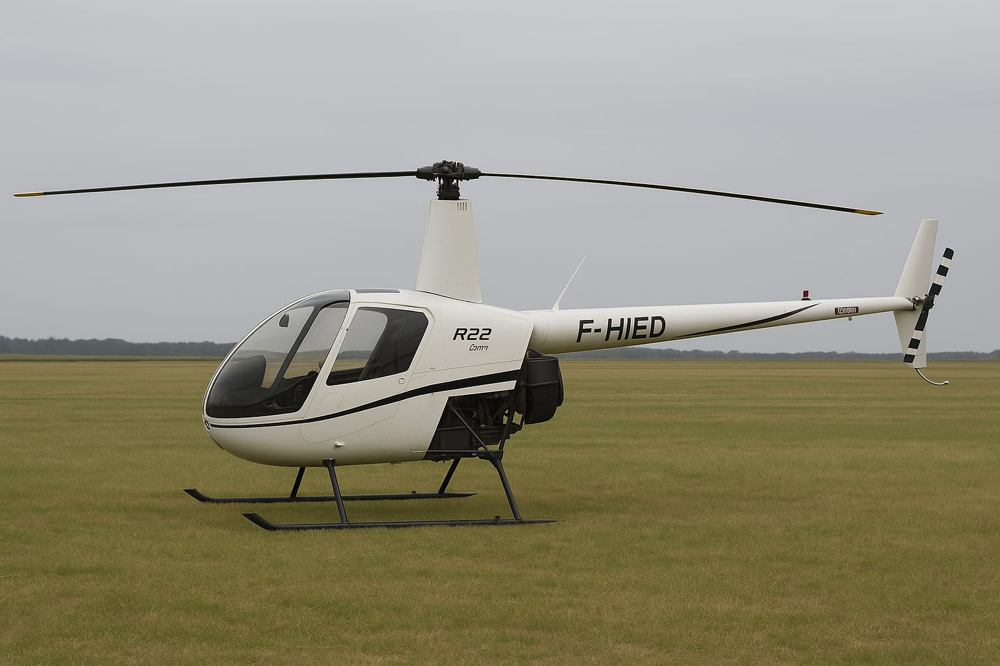
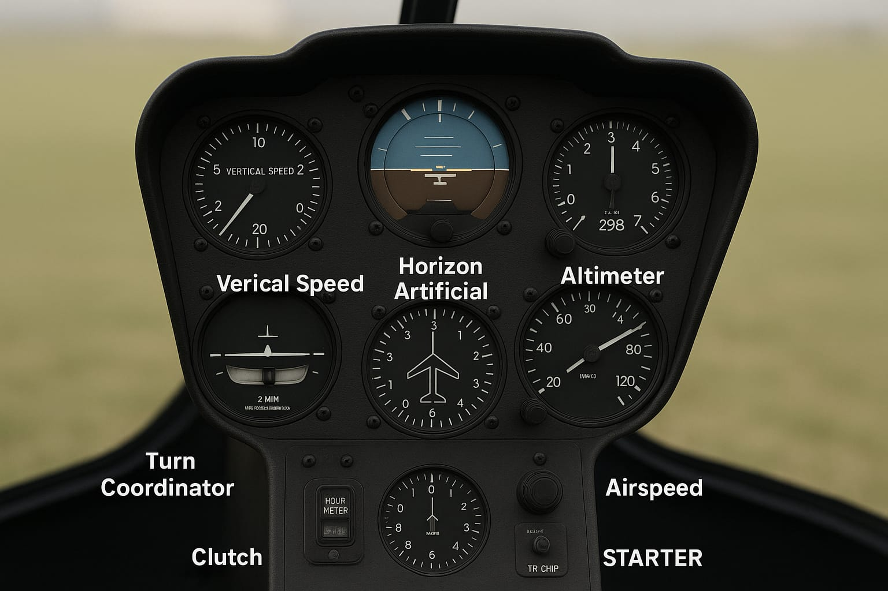
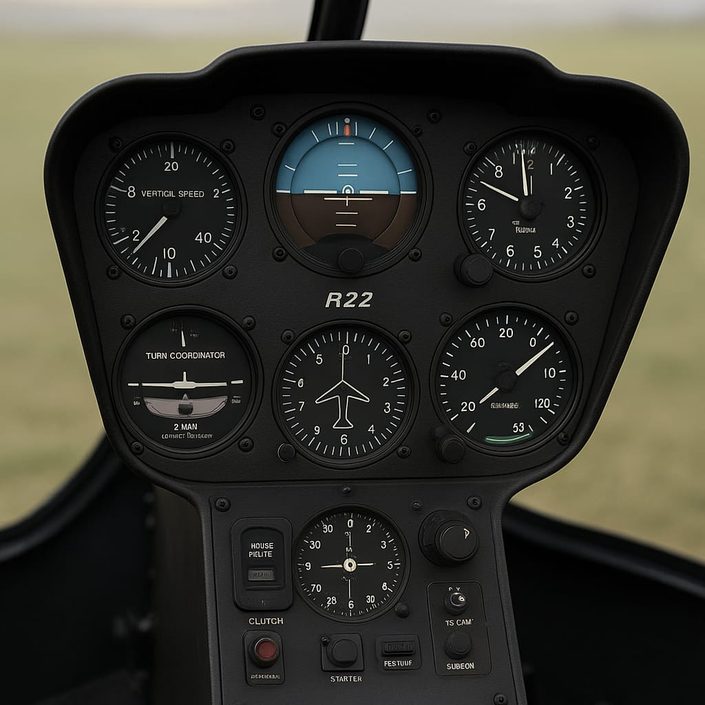
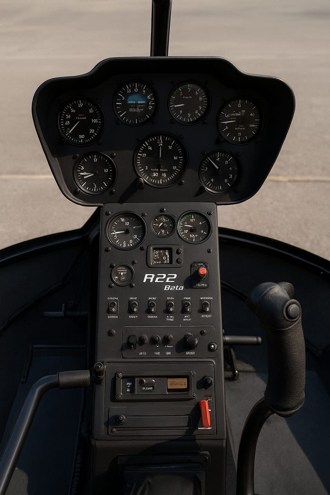
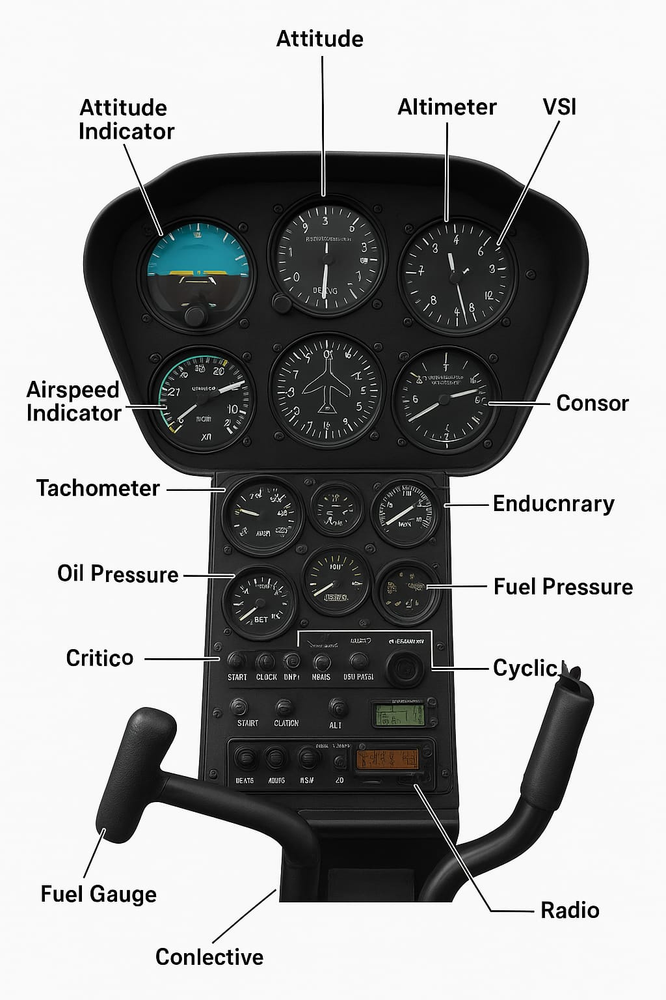

# ✈️ Piloter un hélicoptère – Manuel pratique du Robinson R22

## 📖 Description du projet

Ce manuel complet constitue une référence exhaustive pour l'apprentissage et la maîtrise du pilotage d'hélicoptère Robinson R22. Conçu selon une approche pédagogique structurée, il combine théorie rigoureuse, procédures opérationnelles et dimension philosophique.

**Format** : Documentation technique complète en Markdown
**Langue** : Français
**Public cible** : Élèves pilotes, instructeurs, pilotes privés
**Niveau** : Débutant à confirmé

## 📚 Structure du manuel

### Partie 1 : Découverte et bases du vol (3 chapitres)
- **Chapitre 1** : L'esprit du pilotage - Responsabilités, espaces aériens, types d'hélicoptères
- **Chapitre 2** : Présentation du Robinson R22 - Histoire, caractéristiques techniques, limites
- **Chapitre 3** : Principes de vol d'un hélicoptère - Forces, rotors, dissymétrie, effets

### Partie 2 : Cockpit et commandes (3 chapitres)
- **Chapitre 4** : Le poste de pilotage du R22 - Instruments, commandes, systèmes
- **Chapitre 4 bis** : Détail des instruments du tableau de bord R22 - Description complète de chaque cadran
- **Chapitre 5** : Les systèmes du R22 - Transmission, carburant, lubrification, alarmes

### Partie 3 : Apprendre à piloter (4 chapitres)
- **Chapitre 6** : Préparation avant vol - Inspection, check-lists, météo
- **Chapitre 7** : Premières leçons - Démarrage, stationnaire, décollage
- **Chapitre 8** : Vol de croisière - Maintien paramètres, virages, navigation
- **Chapitre 9** : Approche et atterrissage - Plans, arrondis, atterrissages

### Partie 4 : Urgences et sécurité (2 chapitres)
- **Chapitre 10** : Gestion des pannes - Autorotation, LTE, vortex ring state
- **Chapitre 11** : Sécurité du vol - Facteurs humains, stress, décision pilote

### Partie 5 : Entraînement au sol et simulateur (2 chapitres)
- **Chapitre 12** : Le simulateur comme outil - Configuration, exercices progressifs
- **Chapitre 13** : Exercices pratiques - Stationnaire, translation, manoeuvres

### Partie 6 : Approfondissements techniques (2 chapitres)
- **Chapitre 14** : Aérodynamique avancée - Dissymétrie, précession, calculs
- **Chapitre 15** : Maintenance et inspection pilote - Routines, documents

### Partie 7 : Philosophie du vol (2 chapitres)
- **Chapitre 16** : L'esprit du pilote - Concentration, discipline, relation machine
- **Chapitre 17** : Témoignages et réflexions - Paroles pilotes, leçons apprises

## 📎 Annexes complètes

- **Annexe A** : Glossaire des termes aéronautiques (150+ termes)
- **Annexe B** : Règles de l'air suisses et internationales
- **Annexe C** : Check-lists imprimables (pré-vol, démarrage, urgence)
- **Annexe D** : Fiches de progression d'instructeur (niveaux 1-4)

## 🎨 Synthèses visuelles

Chaque chapitre dispose d'une synthèse visuelle consolidant :
- Concepts clés en schémas ASCII
- Formules importantes
- Check-lists de révision
- Points d'évaluation

## 🖼️ Schémas et images du tableau de bord R22

### Vue d'ensemble du cockpit
```
[assets/tableau-bord-ascii.md](assets/tableau-bord-ascii.md)
```


### Images photographiques du R22

#### Cockpit complet du R22

*Vue générale du cockpit biplace côte à côte*

#### Instruments de vol annotés

*Instruments principaux avec annotations détaillées*

#### Vue rapprochée des instruments

*Détail des cadrans principaux*

#### Version Beta du R22

*Modèle Beta avec équipements modernisés*

#### Cockpit R22 Beta annoté

*Vue détaillée du cockpit avec tous les instruments identifiés*

### Schéma des commandes de vol
```
[assets/commandes-schema.md](assets/commandes-schema.md)
```
- **Collectif** : Gestion portance/puissance (gauche)
- **Cyclique** : Contrôle attitude (centre)
- **Pédales** : Compensation couple (plancher)

### Vue d'ensemble de l'hélicoptère
```
[assets/helicoptere-schema.md](assets/helicoptere-schema.md)
```
- Dimensions et caractéristiques principales
- Systèmes mécaniques
- Forces en vol stationnaire

### Instruments essentiels (T-Attitude-Heading)
```
┌─────────────┬─────────────┬─────────────┬─────────────┐
│ ALTITUDE    │ VITESSE AIR │ ATTITUDE    │ DIRECTION   │
│ 0-30'000 ft │ 0-200 kt    │ ±90°/±30°  │ 360°        │
│ QNH réglage │ Blanc/Jaune │ Horizon art │ Compass mag │
│ pieds/mètres │ Rouge >140kt│ Cageable   │ Bouton      │
└─────────────┴─────────────┴─────────────┴─────────────┘
```

### Instruments moteur et performances
```
┌─────────────┬─────────────┬─────────────┬─────────────┐
│ RPM ROTOR   │ MANIFOLD PR │ TEMP HUILE  │ PRESS HUILE │
│ 0-600 (×100)│ 10-30 inHg  │ 0-120°C     │ 0-7 bar     │
│ Vert 450-510│ 28"=100%   │ Vert 60-100 │ Vert 2.8-4.1│
│ Rouge <430  │             │ Rouge >110  │ Rouge <2.0  │
│ >520 tr/min │             │             │ >5.5        │
└─────────────┴─────────────┴─────────────┴─────────────┘
```

## 🛠️ Fonctionnalités pédagogiques

### Approche structurée
- **Comprendre** : Théorie et principes
- **Appliquer** : Procédures pratiques
- **Maîtriser** : Subtilités et pièges

### Outils intégrés
- Encadrés spéciaux : ⚠️ Attention, 💡 Conseil, ✓ Bonnes pratiques
- Exemples mathématiques concrets
- Tableaux de classification
- Évaluations par chapitre

### Sécurité prioritaire
- Mise en avant des facteurs humains
- Procédures d'urgence détaillées
- Gestion du stress et des erreurs
- Culture de sécurité

## 📋 Utilisation recommandée

### Pour élèves pilotes
1. Lecture complète chapitre par chapitre
2. Application pratique avec instructeur
3. Révision via synthèses visuelles
4. Validation via évaluations

### Pour instructeurs
- Outil pédagogique structuré
- Fiches de progression détaillées
- Référence technique complète
- Support formation continue

### Pour pilotes privés
- Manuel de référence opérationnel
- Révision connaissances
- Préparation recyclage
- Dépannage technique

## 🔧 Technologies et formats

**Format natif** : Markdown (.md) - Compatible GitHub, éditeurs texte
**Visualisation** : Lecteurs Markdown (Typora, Mark Text, VS Code)
**Impression** : Conversion PDF possible
**Collaboration** : Versionnable Git

## 📊 Statistiques du projet

- **18 chapitres** principaux (incluant chapitre 4 bis détaillé)
- **4 annexes** complètes
- **17 synthèses** visuelles
- **3 schémas ASCII** détaillés du tableau de bord
- **5 images photographiques** du cockpit R22
- **Plus de 160 pages** de contenu
- **150+ termes** techniques définis
- **50+ procédures** détaillées
- **100+ schémas** et tableaux ASCII

## 🙏 Remerciements

Ce manuel s'inspire de :
- **Manuel de vol Robinson R22** officiel
- **Publications FAA/EASA** sur sécurité
- **Recherches NTSB/BSU** sur accidents
- **Témoignages pilotes** expérimentés
- **Standards formation** professionnels

## 📞 Support et contribution

**Usage libre** : Ce manuel est destiné à la communauté aéronautique
**Améliorations** : Suggestions bienvenues
**Corrections** : Signalement d'erreurs apprécié

---

*"Le ciel n'a pas de limites, mais le pilote en a. Le vrai art est de danser avec ces limites sans jamais les franchir."*

**Que votre vol soit sûr, vos atterrissages doux, et votre passion éternelle.** ✈️
